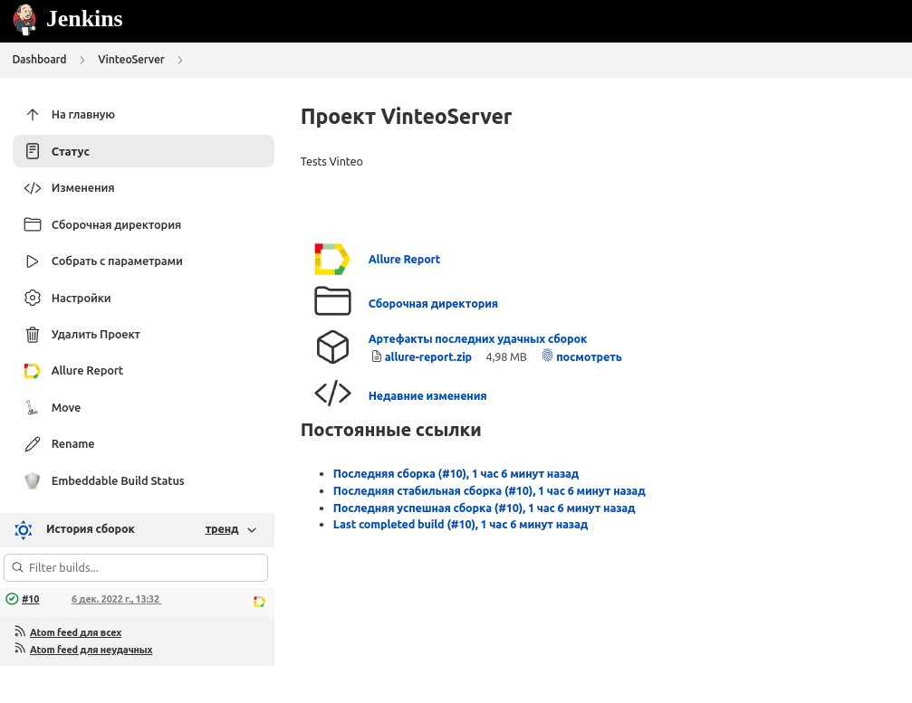
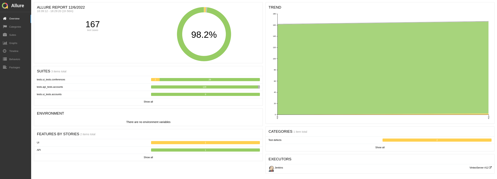
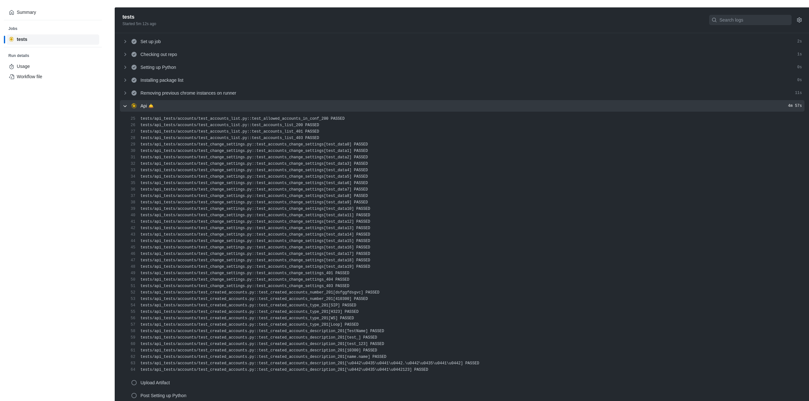
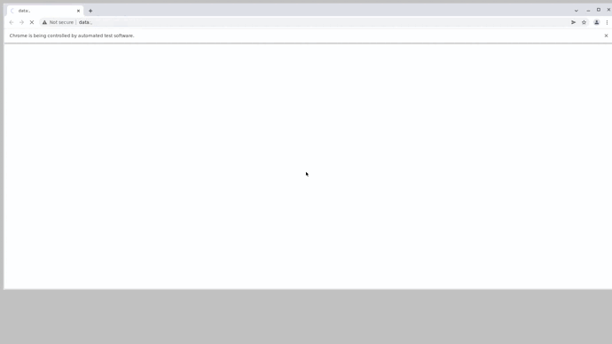
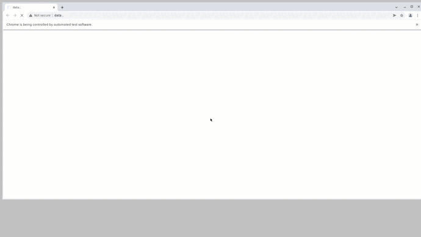
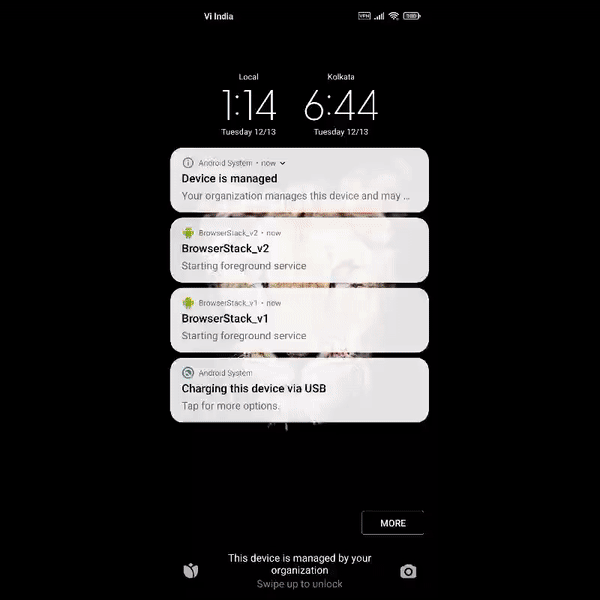
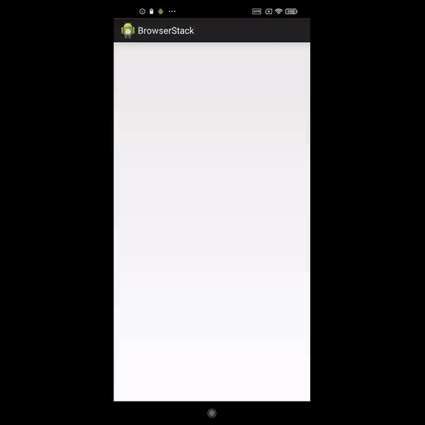
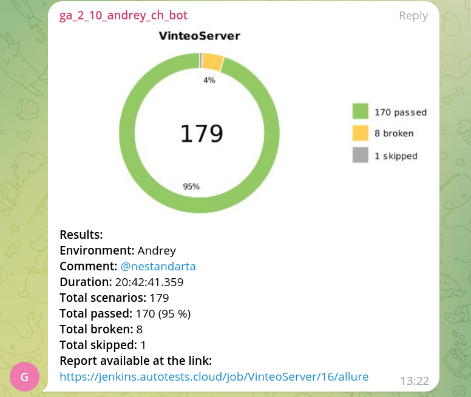

  ## About me:
Стаж работы QA 3 года  
  
  ## Contact me: 
  

  

  
  
  
 ## Stack:
 

<h3> <a href="https://jenkins.autotests.cloud/job/VinteoServer/"> Jenkins </a> - проект интеграции </h3>
    

Открыть скриншот

        
    

<h3> <a href="https://jenkins.autotests.cloud/job/VinteoServer/allure/"> Allure Report </a> - График прохождения тестов</h3>
    

Открыть скриншот

        
    

<h3> Api tests GitHub Action </h3>
    

Открыть скриншот

        
    

<h3> Selenoid </h3>
    

Видео прогона тестов

        
        
    

<h3> Browserstack </h3>
    

Видео мобильных тестов

        
        
    

<h3> Telegram Bot для оповещения о результатх тестирования </h3>
    

"Краткий отчет в Telegram"

        
    

## My projects:
### :star: <a target="_blank" href="https://github.com/andreychashkin/qa_quru_api.git">Автотесты сервера ВКС(небольшая часть наработок)</a>

 

